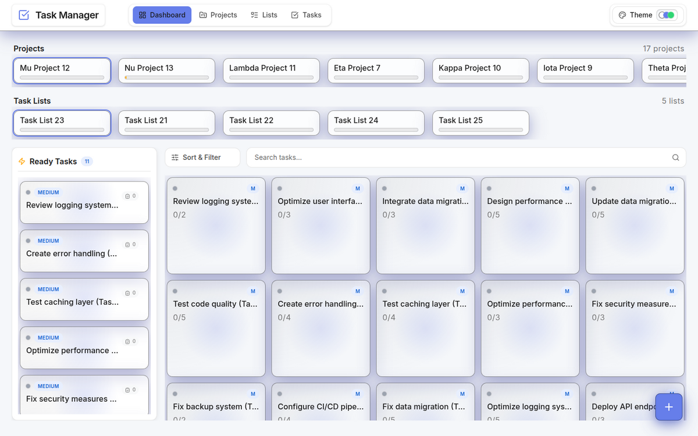
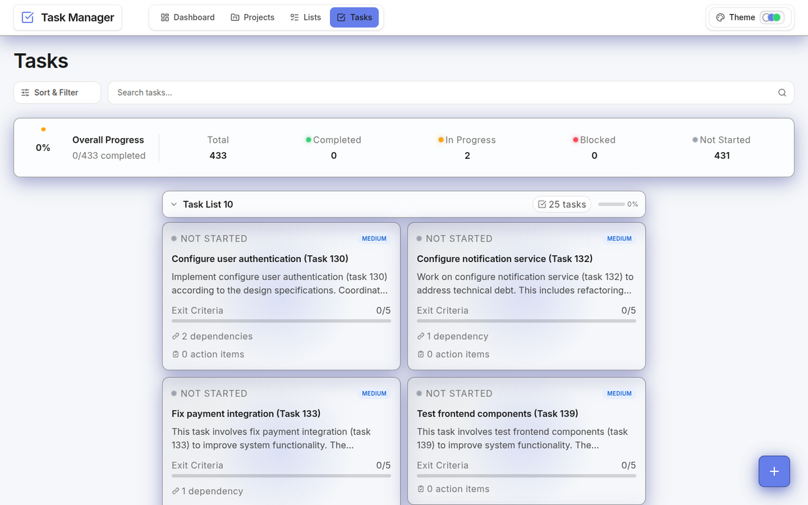
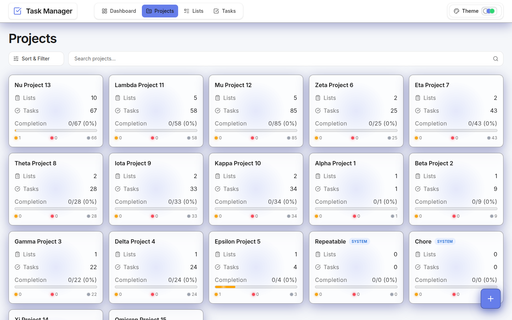
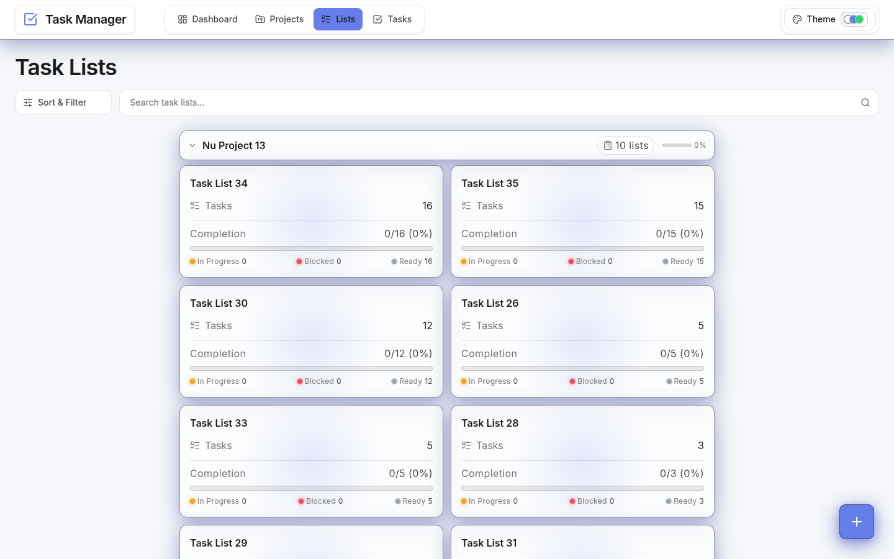
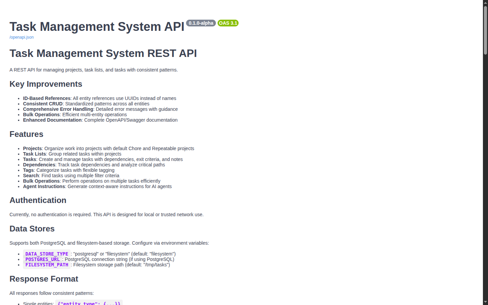

# ✅ TasksMultiServer — Visual Showcase

Hierarchical task management (Projects → Task Lists → Tasks) for both humans and AI agents, accessible via **MCP server**, **REST API**, and a **React web UI**.

> _Screenshots from a local Docker Compose run (FastAPI + React + PostgreSQL), seeded with the project's test-data generator (17 projects, 35 task lists, 433 tasks with dependencies)._

---

## 🗂️ Dashboard
Projects, task lists, and a "Ready Tasks" board (dependency-unblocked tasks) at a glance.

## ✅ Tasks
Every task with status, priority, exit criteria, action items, and dependency counts — plus overall progress and status breakdown.

## 📁 Projects
Project overview with per-project list/task counts and completion.

## 📋 Task Lists
The middle tier of the hierarchy — lists grouped by project with ready/blocked/in-progress counts.

## 🔌 REST API
The same data is available over a documented REST API (OpenAPI/Swagger) — and over MCP for AI agents.

---

## ✨ At a Glance

| Capability | Detail |
|------------|--------|
| **Interfaces** | MCP server (AI agents) · REST API · React web UI |
| **Hierarchy** | Projects → Task Lists → Tasks |
| **Dependencies** | DAG-based with circular-dependency detection |
| **Storage** | Pluggable — PostgreSQL or filesystem |
| **Tasks** | Status, priority, exit criteria, action items, metadata |
| **Agent-friendly** | Template instructions, parameter preprocessing, rich errors |
| **Stack** | FastAPI (Python) · React + Vite + Tailwind · PostgreSQL · Docker |

---

_See the [README](README.md) for setup (Docker Compose), MCP configuration, and the API reference._
