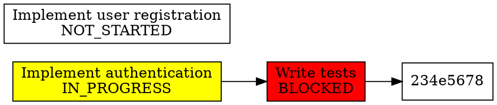
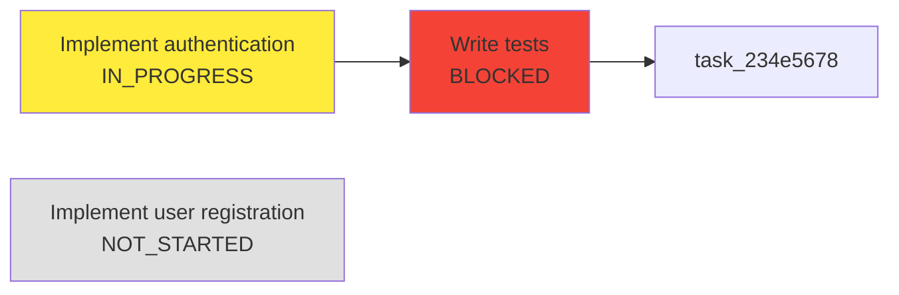

# MCP Tools API Reference

This document provides a comprehensive reference for all Model Context Protocol (MCP) tools available in the TasksMultiServer system. These tools enable AI agents to interact with the task management system through the MCP protocol.

## Table of Contents

- [Overview](#overview)
- [Project Management Tools](#project-management-tools)
- [Task List Management Tools](#task-list-management-tools)
- [Task Management Tools](#task-management-tools)
- [Task Update Tools](#task-update-tools)
- [Tag Management Tools](#tag-management-tools)
- [Search Tools](#search-tools)
- [Dependency Analysis Tools](#dependency-analysis-tools)
- [Error Handling](#error-handling)
- [Common Patterns](#common-patterns)

## Overview

All MCP tools in TasksMultiServer follow these conventions:

- **UUIDs**: All entity IDs are UUIDs in string format
- **Enums**: Status and Priority values are uppercase strings
- **Timestamps**: ISO 8601 format (e.g., "2024-01-15T10:30:00")
- **Arrays**: Can be provided as JSON strings or native arrays (automatic preprocessing)
- **Error Handling**: All errors include visual indicators (❌, 💡, 📝, 🔧) and actionable guidance

### Automatic Type Conversion

The MCP server includes automatic preprocessing for agent-friendly inputs:

- String numbers → Numbers: `"5"` → `5`
- JSON strings → Arrays: `'["tag1", "tag2"]'` → `["tag1", "tag2"]`
- Boolean strings → Booleans: `"true"`, `"yes"`, `"1"` → `true`

---

## Project Management Tools

### list_projects

List all projects in the task management system, including default projects (Chore and Repeatable).

**Input Schema:**

```json
{
  "type": "object",
  "properties": {},
  "required": []
}
```

**Example Request:**

```json
{
  "name": "list_projects",
  "arguments": {}
}
```

**Example Response:**

```
Projects:
- Chore (ID: 123e4567-e89b-12d3-a456-426614174000) [DEFAULT]
  Created: 2024-01-15T10:30:00
  Updated: 2024-01-15T10:30:00
```

- Repeatable (ID: 223e4567-e89b-12d3-a456-426614174001) [DEFAULT]
  Created: 2024-01-15T10:30:00
  Updated: 2024-01-15T10:30:00
- My Project (ID: 323e4567-e89b-12d3-a456-426614174002)
  Template: You are working on {{project_name}}...
  Created: 2024-01-15T11:00:00
  Updated: 2024-01-15T11:00:00

````

**Error Cases:**
- Storage errors: Database or filesystem connectivity issues

---

## Task List Management Tools

### get_task_list

Retrieve a task list by its ID, including all its tasks.

**Input Schema:**
```json
{
  "type": "object",
  "properties": {
    "task_list_id": {
      "type": "string",
      "description": "The UUID of the task list to retrieve"
    }
  },
  "required": ["task_list_id"]
}
````

**Example Request:**

```json
{
  "name": "get_task_list",
  "arguments": {
    "task_list_id": "456e7890-e89b-12d3-a456-426614174003"
  }
}
```

**Example Response:**

```
Task List: Sprint 1 Tasks
ID: 456e7890-e89b-12d3-a456-426614174003
Project ID: 323e4567-e89b-12d3-a456-426614174002
Created: 2024-01-15T11:00:00
Updated: 2024-01-15T11:30:00

Tasks (2):
- Implement authentication (ID: 789e0123-e89b-12d3-a456-426614174004)
  Status: IN_PROGRESS
  Priority: HIGH
  Description: Implement user authentication with JWT tokens...
  Dependencies: 0
  Exit Criteria: 3
```

- Write tests (ID: 890e1234-e89b-12d3-a456-426614174005)
  Status: BLOCKED
  Priority: MEDIUM
  Description: Write unit tests for authentication module...
  Dependencies: 1
  Exit Criteria: 2
  ⚠️ BLOCKED: Task has 1 incomplete dependency
  Blocking tasks: Implement authentication

````

**Error Cases:**
- `task_list_id` missing: "Error: task_list_id is required"
- Invalid UUID format: "Error: Invalid UUID format: {value}"
- Task list not found: "Task list with ID {id} not found"

### create_task_list

Create a new task list with project assignment logic.

**Assignment Logic:**
- If `repeatable=true`: Assigns to 'Repeatable' project
- If no `project_name` specified: Assigns to 'Chore' project
- Otherwise: Assigns to specified project (creating it if needed)

**Input Schema:**
```json
{
  "type": "object",
  "properties": {
    "name": {
      "type": "string",
      "description": "The name of the task list"
    },
    "project_name": {
      "type": "string",
      "description": "Optional name of the project to assign to"
    },
    "repeatable": {
      "type": "boolean",
      "description": "Whether this is a repeatable task list"
    },
    "agent_instructions_template": {
      "type": "string",
      "description": "Optional template for generating agent instructions"
    }
  },
  "required": ["name"]
}
````

**Example Request:**

```json
{
  "name": "create_task_list",
  "arguments": {
    "name": "Sprint 2 Tasks",
    "project_name": "My Project",
    "agent_instructions_template": "Work on {{task_title}} for Sprint 2"
  }
}
```

**Example Response:**

```
Task list 'Sprint 2 Tasks' created successfully
ID: 567e8901-e89b-12d3-a456-426614174006
Project ID: 323e4567-e89b-12d3-a456-426614174002
Template: Work on {{task_title}} for Sprint 2...
Created: 2024-01-15T12:00:00
```

**Error Cases:**

- `name` missing: "Error: name is required"
- Invalid `repeatable` value: Automatically converted from string to boolean

### delete_task_list

Delete a task list and all its tasks.

**Input Schema:**

```json
{
  "type": "object",
  "properties": {
    "task_list_id": {
      "type": "string",
      "description": "The UUID of the task list to delete"
    }
  },
  "required": ["task_list_id"]
}
```

**Example Request:**

```json
{
  "name": "delete_task_list",
  "arguments": {
    "task_list_id": "567e8901-e89b-12d3-a456-426614174006"
  }
}
```

**Example Response:**

```
Task list with ID 567e8901-e89b-12d3-a456-426614174006 deleted successfully
```

**Error Cases:**

- `task_list_id` missing: "Error: task_list_id is required"
- Invalid UUID format: "Error: Invalid UUID format: {value}"
- Task list not found: Validation error with details

---

## Task Management Tools

### create_task

Create a new task with all required fields and optional fields.

**Required Fields:**

- `task_list_id`: UUID of the parent task list
- `title`: Short title describing the task
- `description`: Detailed description
- `status`: One of `NOT_STARTED`, `IN_PROGRESS`, `BLOCKED`, `COMPLETED`
- `exit_criteria`: Array of exit criteria (must not be empty)
- `priority`: One of `CRITICAL`, `HIGH`, `MEDIUM`, `LOW`, `TRIVIAL`

**Optional Fields:**

- `dependencies`: Array of task dependencies (default: empty)
- `notes`: Array of general notes (default: empty)
- `research_notes`: Array of research notes
- `action_plan`: Ordered array of action items
- `execution_notes`: Array of execution notes
- `agent_instructions_template`: Template for agent instructions
- `tags`: Array of tags for categorization

**Input Schema:**

```json
{
  "type": "object",
  "properties": {
    "task_list_id": {"type": "string"},
    "title": {"type": "string"},
    "description": {"type": "string"},
    "status": {
      "type": "string",
      "enum": ["NOT_STARTED", "IN_PROGRESS", "BLOCKED", "COMPLETED"]
    },
    "dependencies": {
      "oneOf": [
        {"type": "string"},
        {
          "type": "array",
          "items": {
            "type": "object",
            "properties": {
              "task_id": {"type": "string"},
              "task_list_id": {"type": "string"}
            }
          }
        }
      ]
    },
```

    "exit_criteria": {
      "oneOf": [
        {"type": "string"},
        {
          "type": "array",
          "items": {
            "type": "object",
            "properties": {
              "criteria": {"type": "string"},
              "status": {"type": "string", "enum": ["INCOMPLETE", "COMPLETE"]},
              "comment": {"type": "string"}
            }
          }
        }
      ]
    },
    "priority": {
      "type": "string",
      "enum": ["CRITICAL", "HIGH", "MEDIUM", "LOW", "TRIVIAL"]
    },
    "notes": {"oneOf": [{"type": "string"}, {"type": "array"}]},
    "tags": {"oneOf": [{"type": "string"}, {"type": "array"}]}

},
"required": ["task_list_id", "title", "description", "status", "exit_criteria", "priority"]
}

````

**Example Request:**
```json
{
  "name": "create_task",
  "arguments": {
    "task_list_id": "456e7890-e89b-12d3-a456-426614174003",
    "title": "Implement user registration",
    "description": "Create user registration endpoint with email validation",
    "status": "NOT_STARTED",
    "priority": "HIGH",
    "exit_criteria": [
      {"criteria": "Registration endpoint created", "status": "INCOMPLETE"},
      {"criteria": "Email validation implemented", "status": "INCOMPLETE"},
      {"criteria": "Tests written and passing", "status": "INCOMPLETE"}
    ],
    "dependencies": [],
    "notes": [],
    "tags": ["backend", "authentication"]
  }
}
````

**Example Response:**

```
Task 'Implement user registration' created successfully
ID: 901e2345-e89b-12d3-a456-426614174007
Task List ID: 456e7890-e89b-12d3-a456-426614174003
Status: NOT_STARTED
Priority: HIGH
Exit Criteria: 3
Tags: backend, authentication
Created: 2024-01-15T12:30:00
```

**Error Cases:**

- Missing required fields: Enhanced error with field name and guidance
- Invalid status/priority: Lists all valid enum values
- Empty exit_criteria: "Error: exit_criteria is required and must not be empty"
- Invalid dependency format: "Error: Invalid dependency format: {details}"
- Invalid tag (too long, invalid characters): Validation error with guidance

### get_agent_instructions

Generate agent instructions for a task using template resolution hierarchy.

**Template Resolution Order:**

1. Task-level template
2. Task list-level template
3. Project-level template
4. Fallback template

**Available Variables:**

- `{{task_title}}`: Task title
- `{{task_description}}`: Task description
- `{{task_status}}`: Task status
- `{{task_priority}}`: Task priority
- `{{project_name}}`: Project name
- `{{task_list_name}}`: Task list name

**Input Schema:**

```json
{
  "type": "object",
  "properties": {
    "task_id": {
      "type": "string",
      "description": "The UUID of the task"
    }
  },
  "required": ["task_id"]
}
```

**Example Request:**

```json
{
  "name": "get_agent_instructions",
  "arguments": {
    "task_id": "901e2345-e89b-12d3-a456-426614174007"
  }
}
```

**Example Response:**

```
Agent Instructions for: Implement user registration

Work on Implement user registration for Sprint 1 Tasks

Task Details:
- Status: NOT_STARTED
- Priority: HIGH
- Description: Create user registration endpoint with email validation

Exit Criteria:
1. [INCOMPLETE] Registration endpoint created
2. [INCOMPLETE] Email validation implemented
3. [INCOMPLETE] Tests written and passing
```

**Error Cases:**

- `task_id` missing: "Error: task_id is required"
- Invalid UUID: "Error: Invalid UUID format: {value}"
- Task not found: Validation error

### get_ready_tasks

Retrieve tasks that are ready for execution within a specified scope.

**Ready Task Definition:**
A task is ready if:

- It has no dependencies, OR
- All its dependencies are completed

**Scope Types:**

- `project`: All ready tasks in a project
- `task_list`: All ready tasks in a task list

**Input Schema:**

```json
{
  "type": "object",
  "properties": {
    "scope_type": {
      "type": "string",
      "enum": ["project", "task_list"]
    },
    "scope_id": {
      "type": "string",
      "description": "UUID of the project or task list"
    }
  },
  "required": ["scope_type", "scope_id"]
}
```

**Example Request:**

```json
{
  "name": "get_ready_tasks",
  "arguments": {
    "scope_type": "task_list",
    "scope_id": "456e7890-e89b-12d3-a456-426614174003"
  }
}
```

**Example Response:**

```
Ready tasks in task_list (ID: 456e7890-e89b-12d3-a456-426614174003):
Total: 2 tasks

- Implement user registration (ID: 901e2345-e89b-12d3-a456-426614174007)
  Status: NOT_STARTED
  Priority: HIGH
  Description: Create user registration endpoint with email validation...
  Task List ID: 456e7890-e89b-12d3-a456-426614174003
  Dependencies: None
  Exit Criteria: 3 total, 3 incomplete

- Update documentation (ID: 012e3456-e89b-12d3-a456-426614174008)
  Status: NOT_STARTED
  Priority: LOW
  Description: Update API documentation with new endpoints...
  Task List ID: 456e7890-e89b-12d3-a456-426614174003
  Dependencies: 1 (all completed)
  Exit Criteria: 1 total, 1 incomplete
```

**Error Cases:**

- `scope_type` missing: "Error: scope_type is required"
- Invalid scope_type: "Error: Invalid scope_type '{value}'. Must be 'project' or 'task_list'"
- `scope_id` missing: "Error: scope_id is required"
- Invalid UUID: "Error: Invalid UUID format: {value}"

---

## Task Update Tools

### update_task_dependencies

Update task dependencies with circular dependency validation.

**Input Schema:**

```json
{
  "type": "object",
  "properties": {
    "task_id": { "type": "string" },
    "dependencies": {
      "type": "array",
      "items": {
        "type": "object",
        "properties": {
          "task_id": { "type": "string" },
          "task_list_id": { "type": "string" }
        }
      }
    }
  },
  "required": ["task_id", "dependencies"]
}
```

**Example Request:**

```json
{
  "name": "update_task_dependencies",
  "arguments": {
    "task_id": "012e3456-e89b-12d3-a456-426614174008",
    "dependencies": [
      {
        "task_id": "901e2345-e89b-12d3-a456-426614174007",
        "task_list_id": "456e7890-e89b-12d3-a456-426614174003"
      }
    ]
  }
}
```

**Example Response:**

```
Dependencies updated successfully. Task now has 1 dependency.
```

**Error Cases:**

- Circular dependency detected: "Error: Circular dependency detected: {cycle details}"
- Invalid dependency format: "Error: Invalid dependency format: {details}"

### add_task_note

Add a general note to a task.

**Input Schema:**

```json
{
  "type": "object",
  "properties": {
    "task_id": { "type": "string" },
    "content": { "type": "string" }
  },
  "required": ["task_id", "content"]
}
```

**Example Request:**

```json
{
  "name": "add_task_note",
  "arguments": {
    "task_id": "901e2345-e89b-12d3-a456-426614174007",
    "content": "Need to coordinate with frontend team on API contract"
  }
}
```

**Example Response:**

```
Note added successfully
```

### add_research_note

Add a research note to a task.

**Input Schema:**

```json
{
  "type": "object",
  "properties": {
    "task_id": { "type": "string" },
    "content": { "type": "string" }
  },
  "required": ["task_id", "content"]
}
```

**Example Request:**

```json
{
  "name": "add_research_note",
  "arguments": {
    "task_id": "901e2345-e89b-12d3-a456-426614174007",
    "content": "Researched bcrypt vs argon2 for password hashing. Argon2 recommended."
  }
}
```

**Example Response:**

```
Research note added successfully
```

### update_action_plan

Update the action plan for a task (replaces existing action plan).

**Input Schema:**

```json
{
  "type": "object",
  "properties": {
    "task_id": { "type": "string" },
    "action_plan": {
      "type": "array",
      "items": {
        "type": "object",
        "properties": {
          "sequence": { "type": "integer" },
          "content": { "type": "string" }
        }
      }
    }
  },
  "required": ["task_id", "action_plan"]
}
```

**Example Request:**

```json
{
  "name": "update_action_plan",
  "arguments": {
    "task_id": "901e2345-e89b-12d3-a456-426614174007",
    "action_plan": [
      { "sequence": 1, "content": "Create database schema for users table" },
      { "sequence": 2, "content": "Implement registration endpoint" },
      { "sequence": 3, "content": "Add email validation logic" },
      { "sequence": 4, "content": "Write unit tests" }
    ]
  }
}
```

**Example Response:**

```
Action plan updated successfully with 4 items
```

### add_execution_note

Add an execution note to a task.

**Input Schema:**

```json
{
  "type": "object",
  "properties": {
    "task_id": { "type": "string" },
    "content": { "type": "string" }
  },
  "required": ["task_id", "content"]
}
```

**Example Request:**

```json
{
  "name": "add_execution_note",
  "arguments": {
    "task_id": "901e2345-e89b-12d3-a456-426614174007",
    "content": "Completed database schema. Moving to endpoint implementation."
  }
}
```

**Example Response:**

```
Execution note added successfully
```

### update_exit_criteria

Update exit criteria for a task, marking individual criteria as COMPLETE or INCOMPLETE.

**Input Schema:**

```json
{
  "type": "object",
  "properties": {
    "task_id": { "type": "string" },
    "exit_criteria": {
      "oneOf": [
        { "type": "string" },
        {
          "type": "array",
          "items": {
            "type": "object",
            "properties": {
              "criteria": { "type": "string" },
              "status": {
                "type": "string",
                "enum": ["INCOMPLETE", "COMPLETE"]
              },
              "comment": { "type": "string" }
            }
          }
        }
      ]
    }
  },
  "required": ["task_id", "exit_criteria"]
}
```

**Example Request:**

```json
{
  "name": "update_exit_criteria",
  "arguments": {
    "task_id": "901e2345-e89b-12d3-a456-426614174007",
    "exit_criteria": [
      { "criteria": "Registration endpoint created", "status": "COMPLETE" },
      { "criteria": "Email validation implemented", "status": "COMPLETE" },
      { "criteria": "Tests written and passing", "status": "INCOMPLETE" }
    ]
  }
}
```

**Example Response:**

```
Exit criteria updated successfully. 2/3 criteria complete.
```

### update_task_status

Update task status with exit criteria validation.

**Validation Rule:**
Cannot mark task as COMPLETED unless all exit criteria are COMPLETE.

**Input Schema:**

```json
{
  "type": "object",
  "properties": {
    "task_id": { "type": "string" },
    "status": {
      "type": "string",
      "enum": ["NOT_STARTED", "IN_PROGRESS", "BLOCKED", "COMPLETED"]
    }
  },
  "required": ["task_id", "status"]
}
```

**Example Request:**

```json
{
  "name": "update_task_status",
  "arguments": {
    "task_id": "901e2345-e89b-12d3-a456-426614174007",
    "status": "IN_PROGRESS"
  }
}
```

**Example Response:**

```
Task status updated successfully to IN_PROGRESS
```

**Error Cases:**

- Attempting to mark COMPLETED with incomplete exit criteria: Validation error with details
- Invalid status value: Lists all valid enum values

---

## Tag Management Tools

### add_task_tags

Add tags to a task with validation and deduplication.

**Tag Validation Rules:**

- Non-empty string
- Maximum 50 characters
- Valid characters: Unicode letters, numbers, emoji, hyphens, underscores
- Maximum 10 tags per task
- Duplicates automatically prevented

**Input Schema:**

```json
{
  "type": "object",
  "properties": {
    "task_id": { "type": "string" },
    "tags": {
      "oneOf": [
        { "type": "string" },
        { "type": "array", "items": { "type": "string" } }
      ]
    }
  },
  "required": ["task_id", "tags"]
}
```

**Example Request (Array):**

```json
{
  "name": "add_task_tags",
  "arguments": {
    "task_id": "901e2345-e89b-12d3-a456-426614174007",
    "tags": ["backend", "authentication", "high-priority"]
  }
}
```

**Example Request (JSON String):**

```json
{
  "name": "add_task_tags",
  "arguments": {
    "task_id": "901e2345-e89b-12d3-a456-426614174007",
    "tags": "[\"backend\", \"authentication\", \"high-priority\"]"
  }
}
```

**Example Response:**

```
Tags added successfully. Task now has 3 tags: backend, authentication, high-priority
```

**Error Cases:**

- Empty tag: "Tag cannot be empty"
- Tag too long: "Tag exceeds 50 character limit"
- Invalid characters: "Tag contains invalid characters. Use letters, numbers, emoji, hyphens, or underscores"
- Too many tags: "Task cannot have more than 10 tags"
- Duplicate tags: Silently deduplicated

### remove_task_tags

Remove tags from a task. Tags that don't exist on the task are silently ignored.

**Input Schema:**

```json
{
  "type": "object",
  "properties": {
    "task_id": { "type": "string" },
    "tags": {
      "oneOf": [
        { "type": "string" },
        { "type": "array", "items": { "type": "string" } }
      ]
    }
  },
  "required": ["task_id", "tags"]
}
```

**Example Request:**

```json
{
  "name": "remove_task_tags",
  "arguments": {
    "task_id": "901e2345-e89b-12d3-a456-426614174007",
    "tags": ["high-priority"]
  }
}
```

**Example Response:**

```
Tags removed successfully. Task now has 2 tags: backend, authentication
```

---

## Search Tools

### search_tasks

Search and filter tasks by multiple criteria with pagination and sorting.

**Search Features:**

- Text search in titles and descriptions (case-insensitive)
- Filter by status, priority, tags, project
- Pagination support
- Multiple sort options

**Input Schema:**

```json
{
  "type": "object",
  "properties": {
    "query": {
      "type": "string",
      "description": "Text to search in titles and descriptions"
    },
    "status": {
      "oneOf": [
        { "type": "string" },
        {
          "type": "array",
          "items": {
            "type": "string",
            "enum": ["NOT_STARTED", "IN_PROGRESS", "BLOCKED", "COMPLETED"]
          }
        }
      ]
    },
    "priority": {
      "oneOf": [
        { "type": "string" },
        {
          "type": "array",
          "items": {
            "type": "string",
            "enum": ["CRITICAL", "HIGH", "MEDIUM", "LOW", "TRIVIAL"]
          }
        }
      ]
    },
    "tags": {
      "oneOf": [
        { "type": "string" },
        { "type": "array", "items": { "type": "string" } }
      ]
    },
    "project_name": { "type": "string" },
    "limit": { "type": "integer", "default": 50 },
    "offset": { "type": "integer", "default": 0 },
    "sort_by": {
      "type": "string",
      "enum": ["relevance", "created_at", "updated_at", "priority"],
      "default": "relevance"
    }
  },
  "required": []
}
```

**Example Request (Simple Text Search):**

```json
{
  "name": "search_tasks",
  "arguments": {
    "query": "authentication"
  }
}
```

**Example Request (Multi-Criteria Search):**

```json
{
  "name": "search_tasks",
  "arguments": {
    "query": "user",
    "status": ["NOT_STARTED", "IN_PROGRESS"],
    "priority": ["HIGH", "CRITICAL"],
    "tags": ["backend"],
    "project_name": "My Project",
    "limit": 20,
    "offset": 0,
    "sort_by": "priority"
  }
}
```

**Example Response:**

```
Search Results:
Showing 2 of 2 total results (offset: 0, limit: 20)
Sort: priority

Active Filters:
  - Query: 'user'
  - Status: NOT_STARTED, IN_PROGRESS
  - Priority: HIGH, CRITICAL
  - Tags: backend
  - Project: My Project

Tasks:
1. Implement user registration (ID: 901e2345-e89b-12d3-a456-426614174007)
   Status: NOT_STARTED | Priority: HIGH
   Description: Create user registration endpoint with email validation...
   Tags: backend, authentication
   Task List ID: 456e7890-e89b-12d3-a456-426614174003
   Created: 2024-01-15T12:30:00

2. User profile management (ID: 123e4567-e89b-12d3-a456-426614174009)
   Status: IN_PROGRESS | Priority: HIGH
   Description: Implement user profile CRUD operations...
   Tags: backend, user-management
   Task List ID: 456e7890-e89b-12d3-a456-426614174003
   Created: 2024-01-15T13:00:00
```

**Error Cases:**

- Invalid sort criteria: "Invalid sort field. Use: relevance, created_at, updated_at, priority"
- Invalid limit: "Limit must be between 1 and 100"
- Invalid status/priority values: Lists all valid enum values

---

## Dependency Analysis Tools

### analyze_dependencies

Analyze task dependencies within a scope (project or task list).

**Analysis Includes:**

- **Critical Path**: Longest chain of dependent tasks
- **Bottlenecks**: Tasks that block multiple other tasks
- **Leaf Tasks**: Tasks with no dependencies
- **Progress**: Completion percentage
- **Circular Dependencies**: Detected cycles (if any)

**Input Schema:**

```json
{
  "type": "object",
  "properties": {
    "scope_type": {
      "type": "string",
      "enum": ["project", "task_list"]
    },
    "scope_id": { "type": "string" }
  },
  "required": ["scope_type", "scope_id"]
}
```

**Example Request:**

```json
{
  "name": "analyze_dependencies",
  "arguments": {
    "scope_type": "task_list",
    "scope_id": "456e7890-e89b-12d3-a456-426614174003"
  }
}
```

**Example Response:**

```
Dependency Analysis for task_list (ID: 456e7890-e89b-12d3-a456-426614174003)
============================================================

📊 Overall Progress:
  Total Tasks: 5
  Completed Tasks: 2
  Completion: 40.0%

🎯 Critical Path:
  Length: 3 tasks
  Tasks in critical path:
    ○ Implement authentication (ID: 789e0123-e89b-12d3-a456-426614174004)
    ○ Write tests (ID: 890e1234-e89b-12d3-a456-426614174005)
    ● Deploy to staging (ID: 234e5678-e89b-12d3-a456-426614174010)

🚧 Bottleneck Tasks:
  Found 1 bottleneck(s)
    ○ Implement authentication (blocks 2 tasks)
       ID: 789e0123-e89b-12d3-a456-426614174004

🌿 Leaf Tasks (No Dependencies):
  Found 2 leaf task(s)
    ○ Implement user registration (ID: 901e2345-e89b-12d3-a456-426614174007)
    ○ Update documentation (ID: 012e3456-e89b-12d3-a456-426614174008)

🔄 Circular Dependencies:
  ✓ No circular dependencies detected

Legend:
  ○ NOT_STARTED
  ◐ IN_PROGRESS
  ⊗ BLOCKED
  ● COMPLETED
```

**Error Cases:**

- Invalid scope_type: "Error: Invalid scope_type '{value}'. Must be 'project' or 'task_list'"
- Scope not found: Validation error with details

### visualize_dependencies

Generate a visualization of task dependencies in various formats.

**Supported Formats:**

- **ascii**: ASCII art tree structure with box-drawing characters
- **dot**: Graphviz DOT format for rendering with Graphviz tools
- **mermaid**: Mermaid flowchart syntax for rendering in Markdown

**Input Schema:**

```json
{
  "type": "object",
  "properties": {
    "scope_type": {
      "type": "string",
      "enum": ["project", "task_list"]
    },
    "scope_id": { "type": "string" },
    "format": {
      "type": "string",
      "enum": ["ascii", "dot", "mermaid"],
      "default": "ascii"
    }
  },
  "required": ["scope_type", "scope_id", "format"]
}
```

**Example Request (ASCII):**

```json
{
  "name": "visualize_dependencies",
  "arguments": {
    "scope_type": "task_list",
    "scope_id": "456e7890-e89b-12d3-a456-426614174003",
    "format": "ascii"
  }
}
```

**Example Response (ASCII):**

```
Task Dependency Graph
=====================

Implement user registration [NOT_STARTED]
│
Update documentation [NOT_STARTED]
│
Implement authentication [IN_PROGRESS]
├── Write tests [BLOCKED]
│   └── Deploy to staging [NOT_STARTED]
└── User profile management [IN_PROGRESS]
```

**Example Request (DOT):**

```json
{
  "name": "visualize_dependencies",
  "arguments": {
    "scope_type": "task_list",
    "scope_id": "456e7890-e89b-12d3-a456-426614174003",
    "format": "dot"
  }
}
```

**Example Response (DOT):**



**Example Request (Mermaid):**

```json
{
  "name": "visualize_dependencies",
  "arguments": {
    "scope_type": "task_list",
    "scope_id": "456e7890-e89b-12d3-a456-426614174003",
    "format": "mermaid"
  }
}
```

**Example Response (Mermaid):**



**Error Cases:**

- Invalid format: "Error: Invalid format '{value}'. Must be 'ascii', 'dot', or 'mermaid'"
- Invalid scope_type: "Error: Invalid scope_type '{value}'. Must be 'project' or 'task_list'"

---

## Error Handling

All MCP tools use enhanced error formatting with visual indicators and actionable guidance.

### Error Message Format

```
❌ {field}: {problem description}
💡 {actionable guidance}
📝 Example: {working example}

🔧 Common fixes:
1. {fix suggestion 1}
2. {fix suggestion 2}
```

### Error Categories

#### Validation Errors (ValueError)

Occur when input parameters fail validation:

- Missing required fields
- Invalid enum values
- Invalid formats
- Business logic violations

**Example:**

```
Validation error in create_task:

❌ status: Invalid enum value
💡 The status field must be one of the valid status values
📝 Example: "NOT_STARTED"

🔧 Valid values:
- NOT_STARTED
- IN_PROGRESS
- BLOCKED
- COMPLETED
```

#### Storage Errors

Occur when database or filesystem operations fail:

- Database connectivity issues
- Filesystem permission errors
- Transaction failures

**Example:**

```
Storage error in create_task:

❌ Database operation failed: Connection refused
💡 Check database connectivity and configuration

🔧 Common fixes:
1. Verify database is running and accessible
2. Check database credentials
3. Ensure database schema is up to date
```

#### Not Found Errors

Occur when referenced entities don't exist:

- Task not found
- Task list not found
- Project not found

**Example:**

```
Validation error in get_task_list:

❌ task_list_id: Task list not found
💡 Verify the task list ID is correct and the task list exists
📝 Example: Use list_projects to find valid task list IDs
```

---

## Common Patterns

### Working with Arrays

Arrays can be provided as JSON strings or native arrays. The MCP server automatically converts JSON strings to arrays.

**Native Array:**

```json
{
  "tags": ["backend", "authentication"]
}
```

**JSON String (automatically converted):**

```json
{
  "tags": "[\"backend\", \"authentication\"]"
}
```

### Working with Dependencies

Dependencies reference tasks in other task lists:

```json
{
  "dependencies": [
    {
      "task_id": "789e0123-e89b-12d3-a456-426614174004",
      "task_list_id": "456e7890-e89b-12d3-a456-426614174003"
    }
  ]
}
```

### Working with Exit Criteria

Exit criteria track task completion conditions:

```json
{
  "exit_criteria": [
    {
      "criteria": "All tests passing",
      "status": "INCOMPLETE",
      "comment": "3 tests still failing"
    },
    {
      "criteria": "Code reviewed",
      "status": "COMPLETE"
    }
  ]
}
```

### Working with Timestamps

All timestamps use ISO 8601 format:

```json
{
  "timestamp": "2024-01-15T12:30:00"
}
```

### Pagination Pattern

For search and list operations:

```json
{
  "limit": 20,
  "offset": 0
}
```

To get the next page:

```json
{
  "limit": 20,
  "offset": 20
}
```

### Template Variables

Available in agent instruction templates:

- `{{task_title}}`: Task title
- `{{task_description}}`: Task description
- `{{task_status}}`: Task status
- `{{task_priority}}`: Task priority
- `{{project_name}}`: Project name
- `{{task_list_name}}`: Task list name

**Example Template:**

```
You are working on {{task_title}} for {{project_name}}.
Priority: {{task_priority}}
Status: {{task_status}}

Description: {{task_description}}
```

---

## Best Practices

### 1. Use Descriptive Task Titles

Good task titles help with search and organization:

✅ **Good:** "Implement user authentication with JWT"
❌ **Bad:** "Auth stuff"

### 2. Define Clear Exit Criteria

Exit criteria should be specific and measurable:

✅ **Good:** "All unit tests passing with >90% coverage"
❌ **Bad:** "Tests done"

### 3. Use Tags Consistently

Establish a tagging convention for your team:

- **Category tags:** `backend`, `frontend`, `database`
- **Priority tags:** `urgent`, `quick-win`
- **Status tags:** `blocked`, `needs-review`

### 4. Leverage Search Filters

Combine multiple filters for precise results:

```json
{
  "status": ["NOT_STARTED", "IN_PROGRESS"],
  "priority": ["HIGH", "CRITICAL"],
  "tags": ["backend"],
  "sort_by": "priority"
}
```

### 5. Monitor Dependencies

Use dependency analysis to:

- Identify critical path tasks
- Find bottlenecks early
- Detect circular dependencies
- Track overall progress

### 6. Use Blocking Information

Tasks automatically show why they're blocked:

```
⚠️  BLOCKED: Task has 1 incomplete dependency
   Blocking tasks: Implement authentication
```

### 7. Organize with Projects and Task Lists

- **Projects:** High-level organizational units (e.g., "Q1 2024 Goals")
- **Task Lists:** Specific work streams (e.g., "Sprint 1", "Bug Fixes")
- **Tasks:** Individual work items

### 8. Template Hierarchy

Templates are resolved in this order:

1. Task-level template (most specific)
2. Task list-level template
3. Project-level template
4. Fallback template (least specific)

Set templates at the appropriate level for your needs.

---

## Quick Reference

### Status Values

- `NOT_STARTED`: Task hasn't been started
- `IN_PROGRESS`: Task is actively being worked on
- `BLOCKED`: Task is blocked by dependencies or other issues
- `COMPLETED`: Task is finished

### Priority Values

- `CRITICAL`: Must be done immediately
- `HIGH`: Important, should be done soon
- `MEDIUM`: Normal priority
- `LOW`: Can be deferred
- `TRIVIAL`: Nice to have

### Scope Types

- `project`: Scope is a project
- `task_list`: Scope is a task list

### Sort Options

- `relevance`: Sort by search relevance (default for search)
- `created_at`: Sort by creation date
- `updated_at`: Sort by last update date
- `priority`: Sort by priority level

### Visualization Formats

- `ascii`: ASCII art tree structure
- `dot`: Graphviz DOT format
- `mermaid`: Mermaid flowchart syntax

---

## See Also

- [Agent Best Practices Guide](../guides/agent-best-practices.md)
- [REST API Reference](rest-endpoints.md)
- [Getting Started Guide](../GETTING_STARTED.md)
- [Deployment Guide](../DEPLOYMENT.md)
