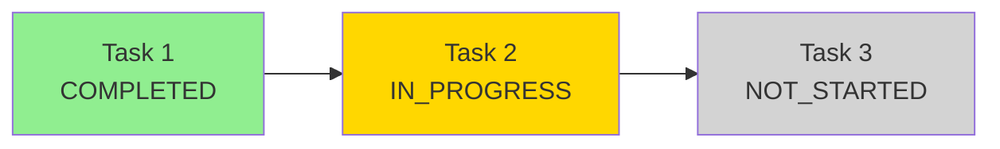

# Dependency Analysis Architecture

This document describes the architecture and implementation of the dependency analysis and visualization system in TasksMultiServer.

## Overview

The dependency analysis system provides comprehensive analysis of task dependency graphs, including:

- Critical path identification
- Bottleneck detection
- Progress calculation
- Circular dependency detection
- Leaf task identification
- Multiple visualization formats (ASCII, DOT, Mermaid)

## Architecture

### Components

```
┌─────────────────────────────────────────────────────────┐
│              Interfaces (MCP/REST)                      │
├─────────────────────────────────────────────────────────┤
│           DependencyOrchestrator                        │
│         (Dependency CRUD operations)                    │
├─────────────────────────────────────────────────────────┤
│            DependencyAnalyzer                           │
│    (Analysis algorithms & visualizations)               │
├─────────────────────────────────────────────────────────┤
│              Data Store                                 │
│         (Task & Dependency storage)                     │
└─────────────────────────────────────────────────────────┘
```

### Key Classes

#### DependencyAnalyzer

**Location**: `src/task_manager/orchestration/dependency_analyzer.py`

**Purpose**: Analyzes dependency graphs and generates visualizations.

**Interface**:

```python
@dataclass
class DependencyAnalysis:
    """Results of dependency graph analysis."""
    critical_path: list[UUID]
    critical_path_length: int
    bottleneck_tasks: list[tuple[UUID, int]]  # (task_id, blocked_count)
    leaf_tasks: list[UUID]
    completion_progress: float
    total_tasks: int
    completed_tasks: int
    circular_dependencies: list[list[UUID]]

class DependencyAnalyzer:
    def __init__(self, data_store: DataStore):
        self.data_store = data_store

    def analyze(self, scope_type: str, scope_id: UUID) -> DependencyAnalysis:
        """Analyze dependencies within a scope (project or task_list)."""

    def visualize_ascii(self, scope_type: str, scope_id: UUID) -> str:
        """Generate ASCII art representation of the DAG."""

    def visualize_dot(self, scope_type: str, scope_id: UUID) -> str:
        """Generate DOT format for Graphviz."""

    def visualize_mermaid(self, scope_type: str, scope_id: UUID) -> str:
        """Generate Mermaid diagram."""
```

## Analysis Algorithms

### 1. Critical Path

**Definition**: The longest chain of dependent tasks from a leaf task to a root task.

**Algorithm**: Topological sort + Dynamic programming

```python
def _find_critical_path(self, tasks: list[Task]) -> list[UUID]:
    """
    Find the critical path using topological sort and DP.

    Steps:
    1. Build adjacency list (task -> dependents)
    2. Topological sort using DFS
    3. Calculate longest path using DP
    4. Backtrack to find the path
    """
    # Build graph
    graph = defaultdict(list)
    in_degree = defaultdict(int)

    for task in tasks:
        for dep in task.dependencies:
            graph[dep.depends_on_task_id].append(task.id)
            in_degree[task.id] += 1

    # Topological sort
    sorted_tasks = self._topological_sort(graph, in_degree)

    # DP: longest_path[task] = max(longest_path[dep]) + 1
    longest_path = {}
    parent = {}

    for task_id in sorted_tasks:
        max_length = 0
        max_parent = None

        for dep_id in [d.depends_on_task_id for d in task.dependencies]:
            if longest_path.get(dep_id, 0) > max_length:
                max_length = longest_path[dep_id]
                max_parent = dep_id

        longest_path[task_id] = max_length + 1
        parent[task_id] = max_parent

    # Find task with longest path
    critical_task = max(longest_path, key=longest_path.get)

    # Backtrack to build path
    path = []
    current = critical_task
    while current:
        path.append(current)
        current = parent.get(current)

    return list(reversed(path))
```

**Time Complexity**: O(V + E) where V = tasks, E = dependencies

### 2. Bottleneck Detection

**Definition**: Tasks that block multiple other tasks (high in-degree).

**Algorithm**: Count incoming edges

```python
def _find_bottlenecks(self, tasks: list[Task]) -> list[tuple[UUID, int]]:
    """
    Find bottleneck tasks by counting how many tasks depend on each.

    A task is a bottleneck if it blocks 2+ other tasks.
    """
    blocked_count = defaultdict(int)

    for task in tasks:
        for dep in task.dependencies:
            blocked_count[dep.depends_on_task_id] += 1

    # Return tasks that block 2+ others
    bottlenecks = [
        (task_id, count)
        for task_id, count in blocked_count.items()
        if count >= 2
    ]

    return sorted(bottlenecks, key=lambda x: x[1], reverse=True)
```

**Time Complexity**: O(V + E)

### 3. Circular Dependency Detection

**Definition**: Cycles in the dependency graph.

**Algorithm**: Depth-first search with cycle detection

```python
def _detect_circular_dependencies(self, tasks: list[Task]) -> list[list[UUID]]:
    """
    Detect circular dependencies using DFS.

    Uses three states:
    - WHITE: Not visited
    - GRAY: Currently visiting (in recursion stack)
    - BLACK: Fully visited

    A back edge (to a GRAY node) indicates a cycle.
    """
    WHITE, GRAY, BLACK = 0, 1, 2
    color = {task.id: WHITE for task in tasks}
    cycles = []

    def dfs(task_id: UUID, path: list[UUID]):
        if color[task_id] == BLACK:
            return

        if color[task_id] == GRAY:
            # Found a cycle
            cycle_start = path.index(task_id)
            cycles.append(path[cycle_start:])
            return

        color[task_id] = GRAY
        path.append(task_id)

        task = next(t for t in tasks if t.id == task_id)
        for dep in task.dependencies:
            dfs(dep.depends_on_task_id, path.copy())

        color[task_id] = BLACK

    for task in tasks:
        if color[task.id] == WHITE:
            dfs(task.id, [])

    return cycles
```

**Time Complexity**: O(V + E)

### 4. Leaf Task Identification

**Definition**: Tasks with no dependencies (can be started immediately).

**Algorithm**: Filter tasks with empty dependency list

```python
def _find_leaf_tasks(self, tasks: list[Task]) -> list[UUID]:
    """Find tasks with no dependencies."""
    return [task.id for task in tasks if not task.dependencies]
```

**Time Complexity**: O(V)

### 5. Progress Calculation

**Definition**: Percentage of completed tasks in the dependency graph.

**Algorithm**: Count completed vs total

```python
def _calculate_progress(self, tasks: list[Task]) -> tuple[float, int, int]:
    """Calculate completion progress."""
    total = len(tasks)
    completed = sum(1 for task in tasks if task.status == Status.COMPLETED)
    progress = (completed / total * 100) if total > 0 else 0.0

    return progress, total, completed
```

**Time Complexity**: O(V)

## Visualization Formats

### 1. ASCII Art

**Purpose**: Terminal-friendly visualization

**Format**: Tree-like structure with box-drawing characters

**Example**:

```
Project: My Project
├── Task 1 [COMPLETED]
│   └── Task 2 [IN_PROGRESS]
│       ├── Task 3 [NOT_STARTED]
│       └── Task 4 [NOT_STARTED]
└── Task 5 [COMPLETED]
    └── Task 6 [BLOCKED]
```

**Implementation**:

```python
def visualize_ascii(self, scope_type: str, scope_id: UUID) -> str:
    """Generate ASCII art representation."""
    tasks = self._get_tasks_in_scope(scope_type, scope_id)

    # Build tree structure
    tree = self._build_tree(tasks)

    # Render with box-drawing characters
    lines = []
    self._render_tree_node(tree, lines, prefix="", is_last=True)

    return "\n".join(lines)

def _render_tree_node(
    self,
    node: dict,
    lines: list[str],
    prefix: str,
    is_last: bool
):
    """Recursively render tree nodes."""
    # Current node
    connector = "└── " if is_last else "├── "
    lines.append(f"{prefix}{connector}{node['title']} [{node['status']}]")

    # Children
    child_prefix = prefix + ("    " if is_last else "│   ")
    children = node.get('children', [])

    for i, child in enumerate(children):
        self._render_tree_node(
            child,
            lines,
            child_prefix,
            is_last=(i == len(children) - 1)
        )
```

### 2. DOT Format (Graphviz)

**Purpose**: Professional graph visualization

**Format**: Standard Graphviz DOT language

**Example**:


**Implementation**:

```python
def visualize_dot(self, scope_type: str, scope_id: UUID) -> str:
    """Generate DOT format for Graphviz."""
    tasks = self._get_tasks_in_scope(scope_type, scope_id)

    lines = [
        "digraph dependencies {",
        "    rankdir=LR;",
        "    node [shape=box, style=rounded];",
        ""
    ]

    # Nodes
    for task in tasks:
        color = self._get_status_color(task.status)
        label = f"{task.title}\\n[{task.status.value}]"
        lines.append(
            f'    "{task.id}" [label="{label}", '
            f'fillcolor={color}, style="rounded,filled"];'
        )

    lines.append("")

    # Edges
    for task in tasks:
        for dep in task.dependencies:
            lines.append(f'    "{dep.depends_on_task_id}" -> "{task.id}";')

    lines.append("}")
    return "\n".join(lines)
```

### 3. Mermaid Diagrams

**Purpose**: Markdown-embeddable diagrams

**Format**: Mermaid flowchart syntax

**Example**:



**Implementation**:

```python
def visualize_mermaid(self, scope_type: str, scope_id: UUID) -> str:
    """Generate Mermaid diagram."""
    tasks = self._get_tasks_in_scope(scope_type, scope_id)

    lines = ["graph LR"]

    # Nodes
    for task in tasks:
        safe_id = str(task.id).replace("-", "")
        label = f"{task.title}<br/>{task.status.value}"
        style_class = self._get_mermaid_class(task.status)
        lines.append(f"    {safe_id}[{label}]:::{style_class}")

    lines.append("")

    # Edges
    for task in tasks:
        safe_task_id = str(task.id).replace("-", "")
        for dep in task.dependencies:
            safe_dep_id = str(dep.depends_on_task_id).replace("-", "")
            lines.append(f"    {safe_dep_id} --> {safe_task_id}")

    lines.append("")

    # Style definitions
    lines.extend([
        "    classDef completed fill:#90EE90",
        "    classDef in_progress fill:#FFD700",
        "    classDef not_started fill:#D3D3D3",
        "    classDef blocked fill:#FF6B6B"
    ])

    return "\n".join(lines)
```

## API Integration

### MCP Tools

**analyze_dependencies**:

```python
{
    "name": "analyze_dependencies",
    "description": "Analyze task dependencies within a scope",
    "inputSchema": {
        "type": "object",
        "properties": {
            "scope_type": {
                "type": "string",
                "enum": ["project", "task_list"]
            },
            "scope_id": {
                "type": "string",
                "format": "uuid"
            }
        },
        "required": ["scope_type", "scope_id"]
    }
}
```

**visualize_dependencies**:

```python
{
    "name": "visualize_dependencies",
    "description": "Visualize task dependencies in various formats",
    "inputSchema": {
        "type": "object",
        "properties": {
            "scope_type": {
                "type": "string",
                "enum": ["project", "task_list"]
            },
            "scope_id": {
                "type": "string",
                "format": "uuid"
            },
            "format": {
                "type": "string",
                "enum": ["ascii", "dot", "mermaid"],
                "default": "ascii"
            }
        },
        "required": ["scope_type", "scope_id"]
    }
}
```

### REST Endpoints

**GET /projects/{id}/dependencies/analysis**:

```json
{
  "critical_path": ["uuid1", "uuid2", "uuid3"],
  "critical_path_length": 3,
  "bottleneck_tasks": [
    ["uuid2", 5],
    ["uuid4", 3]
  ],
  "leaf_tasks": ["uuid1", "uuid5"],
  "completion_progress": 45.5,
  "total_tasks": 10,
  "completed_tasks": 4,
  "circular_dependencies": []
}
```

**GET /projects/{id}/dependencies/visualize?format=ascii**:

Returns visualization string in requested format.

## Performance Considerations

### Time Complexity

| Operation             | Complexity | Notes                     |
| --------------------- | ---------- | ------------------------- |
| Critical Path         | O(V + E)   | Topological sort + DP     |
| Bottleneck Detection  | O(V + E)   | Count incoming edges      |
| Circular Dependencies | O(V + E)   | DFS with cycle detection  |
| Leaf Tasks            | O(V)       | Filter empty dependencies |
| Progress Calculation  | O(V)       | Count completed tasks     |
| ASCII Visualization   | O(V + E)   | Tree traversal            |
| DOT Visualization     | O(V + E)   | Graph traversal           |
| Mermaid Visualization | O(V + E)   | Graph traversal           |

Where:

- V = number of tasks
- E = number of dependencies

### Space Complexity

All algorithms use O(V + E) space for graph representation.

### Optimization Strategies

1. **Caching**: Cache analysis results for repeated queries
2. **Incremental Updates**: Recompute only affected paths when dependencies change
3. **Lazy Loading**: Load tasks on-demand for large graphs
4. **Pagination**: Limit visualization size for large graphs

## Error Handling

### Invalid Scope

```python
if scope_type not in ["project", "task_list"]:
    raise ValueError("Scope type must be 'project' or 'task_list'")
```

### Scope Not Found

```python
if not scope_exists:
    raise NotFoundError(f"{scope_type} with id {scope_id} not found")
```

### Circular Dependencies

```python
if circular_dependencies:
    # Report but don't fail
    analysis.circular_dependencies = circular_dependencies
    logger.warning(f"Circular dependencies detected: {circular_dependencies}")
```

### Empty Graph

```python
if not tasks:
    return DependencyAnalysis(
        critical_path=[],
        critical_path_length=0,
        bottleneck_tasks=[],
        leaf_tasks=[],
        completion_progress=0.0,
        total_tasks=0,
        completed_tasks=0,
        circular_dependencies=[]
    )
```

## Testing

### Unit Tests

Test individual algorithms with synthetic graphs:

```python
def test_critical_path_linear():
    """Test critical path with linear dependency chain."""
    tasks = create_linear_chain(5)
    analyzer = DependencyAnalyzer(mock_store)
    analysis = analyzer.analyze("task_list", task_list_id)

    assert len(analysis.critical_path) == 5
    assert analysis.critical_path_length == 5

def test_bottleneck_detection():
    """Test bottleneck detection with fan-out pattern."""
    tasks = create_fan_out_pattern(1, 5)  # 1 task blocks 5 others
    analyzer = DependencyAnalyzer(mock_store)
    analysis = analyzer.analyze("task_list", task_list_id)

    assert len(analysis.bottleneck_tasks) == 1
    assert analysis.bottleneck_tasks[0][1] == 5
```

### Property-Based Tests

Test properties that should hold for all graphs:

```python
from hypothesis import given, strategies as st

# Feature: agent-ux-enhancements, Property 21: Critical path is longest dependency chain
@given(st.lists(st.uuids(), min_size=1, max_size=10))
def test_critical_path_is_longest(task_ids):
    """Critical path should be the longest chain in the graph."""
    tasks = create_random_dag(task_ids)
    analyzer = DependencyAnalyzer(mock_store)
    analysis = analyzer.analyze("task_list", task_list_id)

    # Verify critical path is actually the longest
    all_paths = find_all_paths(tasks)
    max_path_length = max(len(p) for p in all_paths)
    assert analysis.critical_path_length == max_path_length
```

### Integration Tests

Test with real data stores:

```python
def test_dependency_analysis_integration(postgresql_store):
    """Test dependency analysis with real PostgreSQL."""
    # Create project with complex dependency graph
    project = create_test_project(postgresql_store)
    tasks = create_complex_graph(postgresql_store, project.id)

    analyzer = DependencyAnalyzer(postgresql_store)
    analysis = analyzer.analyze("project", project.id)

    assert analysis.total_tasks == len(tasks)
    assert len(analysis.critical_path) > 0
```

## Future Enhancements

1. **Parallel Critical Paths**: Identify multiple critical paths of equal length
2. **Resource Constraints**: Consider resource availability in analysis
3. **Time Estimates**: Calculate estimated completion time based on task durations
4. **What-If Analysis**: Simulate impact of completing/blocking specific tasks
5. **Interactive Visualizations**: Generate interactive HTML/SVG diagrams
6. **Dependency Metrics**: Calculate additional graph metrics (density, complexity, etc.)
7. **Optimization Suggestions**: Recommend dependency restructuring for better parallelism

## References

- [Graph Algorithms](https://en.wikipedia.org/wiki/Graph_theory)
- [Topological Sorting](https://en.wikipedia.org/wiki/Topological_sorting)
- [Critical Path Method](https://en.wikipedia.org/wiki/Critical_path_method)
- [Graphviz DOT Language](https://graphviz.org/doc/info/lang.html)
- [Mermaid Diagrams](https://mermaid-js.github.io/mermaid/)
